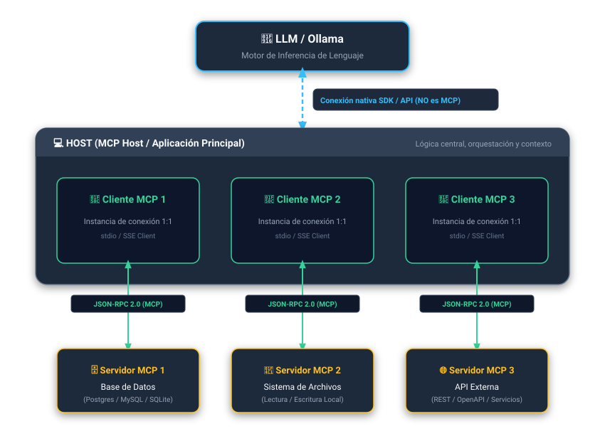

# 2.3.1: Herramientas para el Host

## ¿Qué es el Host y por qué necesita dos conexiones?

El Host es la aplicación con la que interactúa directamente el usuario final: un asistente de IA, una herramienta de programación, o una plataforma de agentes interna (por ejemplo, Claude Desktop, Cursor, o una app propia de la organización). El Host administra la sesión completa, mantiene el contexto del modelo y coordina uno o varios clientes en nombre de dicho modelo.

Para cumplir esta función, el Host necesita **dos conexiones de naturaleza distinta**, que no deben confundirse entre sí:

1. **Conexión al LLM** — vía una API externa (Anthropic, OpenAI) o un motor de inferencia local (por ejemplo, Ollama). Esta conexión **no** usa el protocolo MCP; es la API propia del proveedor o motor del modelo.
2. **Conexión a uno o varios Clientes MCP** — cada Cliente habla el protocolo MCP (JSON-RPC 2.0) con su Servidor correspondiente.

Por cada servidor al que se conecta, el host crea un cliente dedicado que administra esa conexión específica: maneja la autenticación, descubre qué expone el servidor, y traduce las decisiones del modelo en solicitudes con el formato correcto.

## El Host como orquestador — el flujo completo

Cuando un usuario hace una consulta, ambos canales trabajan de forma coordinada:

1. El Host arma el prompt del usuario junto con la lista de herramientas disponibles (obtenida a través del Cliente MCP correspondiente).
2. Envía esa información al LLM (conexión 1).
3. El LLM decide qué herramienta(s) invocar, si es que alguna es necesaria.
4. El Host usa el Cliente MCP correspondiente para ejecutar la llamada contra el Servidor (conexión 2).
5. El resultado de la herramienta regresa al LLM.
6. El LLM genera la respuesta final en lenguaje natural.
7. El Host muestra la respuesta al usuario.

## El Host como responsable de seguridad

Una función crítica del Host es actuar como mediador de todas las interacciones entre la IA y los recursos externos, siguiendo un mapeo de uno a uno entre cada cliente y su servidor, y una seguridad basada en capacidades: los servidores declaran qué pueden hacer, y es el Host quien decide qué permitir.

Es importante tener claro que MCP como protocolo **no impone seguridad por sí mismo** — la especificación estandariza cómo los modelos descubren e invocan herramientas, pero deja la autenticación, la autorización y la seguridad del transporte en manos de quien implemente cada Host, Cliente y Servidor. Esto significa que gran parte de la responsabilidad de seguridad recae directamente en las decisiones de diseño del Host.

Por esta razón, un Host bien diseñado debe:
- Mantener aislamiento de sesión entre distintos usuarios, para evitar que el contexto de uno se filtre al de otro.
- Decidir explícitamente qué servidores MCP están permitidos y qué permisos tiene el LLM para invocarlos.
- Validar las respuestas de los servidores antes de pasarlas al modelo o al usuario.

## Herramientas concretas para construir un Host

**Frameworks de orquestación**
- LangChain, LlamaIndex, o el Vercel AI SDK — facilitan la gestión del ciclo prompt → decisión del modelo → ejecución de herramienta → respuesta.
- Construcción directa combinando el SDK oficial del proveedor del LLM (`anthropic`, `openai`) con el SDK de cliente MCP, sin framework intermedio — el enfoque usado en los tutoriales oficiales de MCP.

**SDKs de conexión al LLM**
- `anthropic` (Python/TypeScript) para la API de Claude.
- `openai` para modelos de OpenAI.
- Cliente HTTP directo (o paquetes como `ollama`) para consumir la API REST de Ollama en `http://localhost:11434`.

**Gestión de la sesión conversacional**
- El historial de mensajes entre ambos canales (LLM y Cliente MCP) es responsabilidad exclusiva del Host — MCP no lo gestiona por sí mismo.

## Hosts de referencia ya existentes

Aplicaciones que ya implementan ambas conexiones (LLM + Cliente(s) MCP) de forma integrada:
- **Claude Desktop** — host de referencia oficial, configurable mediante un archivo `mcpServers`.
- **Cursor** — IDE con soporte nativo de MCP.
- **VS Code** (con extensión MCP) — integra clientes MCP dentro del editor.

(Ver Tema 2.2.2 para el detalle de estas herramientas como clientes de referencia.)

## Consideraciones de diseño propias del Host

- **Multiplicidad de clientes**: un Host puede mantener varios Clientes MCP abiertos simultáneamente —uno por cada servidor conectado—, pero mantiene una sola conexión activa al LLM.
- **Latencia combinada**: el tiempo total de respuesta depende de ambos canales: el tiempo de inferencia del LLM más el tiempo de ejecución de la herramienta en el servidor correspondiente.
- **Gobernanza de servidores**: en un entorno organizacional, conviene mantener una lista controlada de servidores MCP aprobados, para reducir el riesgo de conectar servidores no confiables o comprometidos.

## Referencias
> Model Context Protocol. (s.f.). *Architecture*. Model Context Protocol. https://modelcontextprotocol.io/specification/2026-07-28/architecture

> Latenode. (2026, Mayo 27). *MCP Architecture Explained: Client, Server, and Transport Layer*. Latenode Blog. https://latenode.com/blog/model-context-protocol-architecture

> Zenity. (2026, Julio 9). *What Is the Model Context Protocol? Full Guide*. Zenity Academy. https://zenity.io/academy/model-context-protocol-explained

> Model Context Protocol. (s.f.). *MCP Architecture: Design Philosophy & Engineering Principles*. Model Context Protocol Info. https://modelcontextprotocol.info/docs/concepts/architecture/

> Wiz. (2026, Junio 23). *Understanding Model Context Protocol Security (MCP) in 2026*. Wiz Academy. https://www.wiz.io/academy/ai-security/model-context-protocol-security
